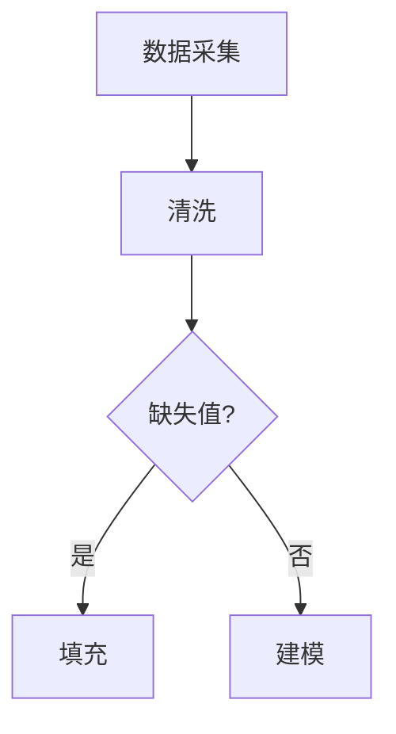

🔧 每日工具 — 2026年07月02日

┏━━━━━━━━━━━━━━━━━━━━━━
┃ 今日推荐：Markdown 图表
┃ 类别：效率技巧
┗━━━━━━━━━━━━━━━━━━━━━━

🎯 解决什么痛点
不用打开 Draw.io 或 Figma，在 Markdown 里直接写代码就能生成流程图、时序图，版本控制友好。

⚡ 快速上手
在 GitHub 或支持 Mermaid 的 Markdown 编辑器中直接写：

💪 为什么比默认方式好
纯文本可 diff，团队协作时一眼看出图表改动，无需导出图片。

🧪 数据科学场景
在项目 README 中描述 ETL 流程、模型训练 pipeline 或实验对比时序图，评审时直接看代码，不用点开图片。